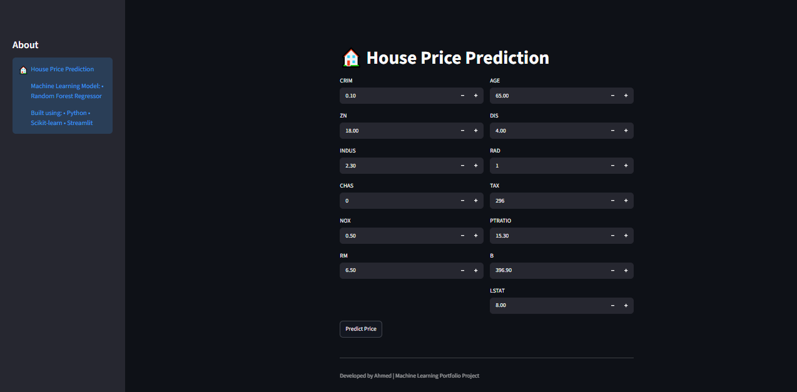
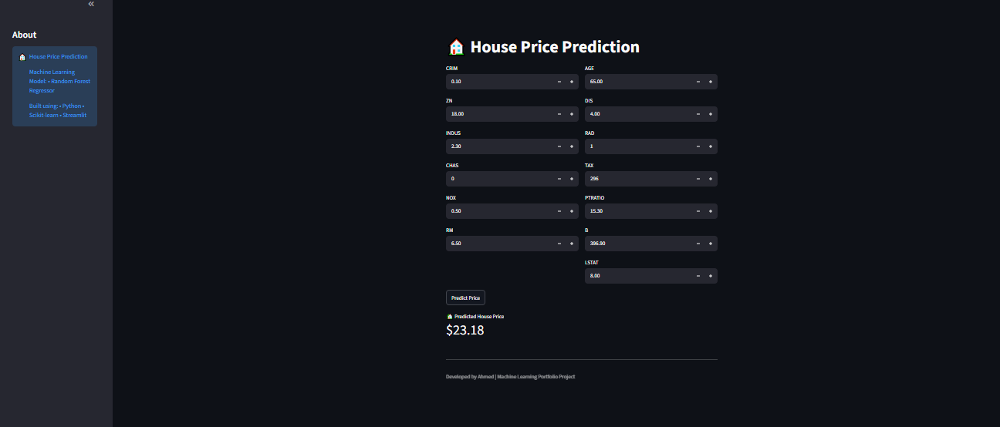
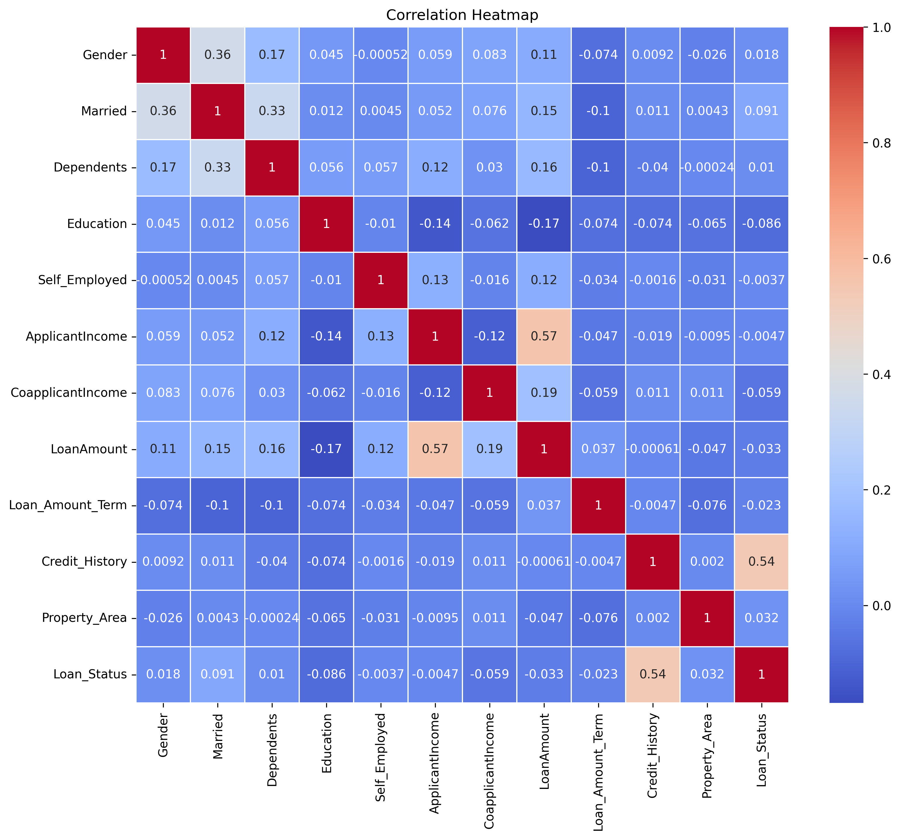
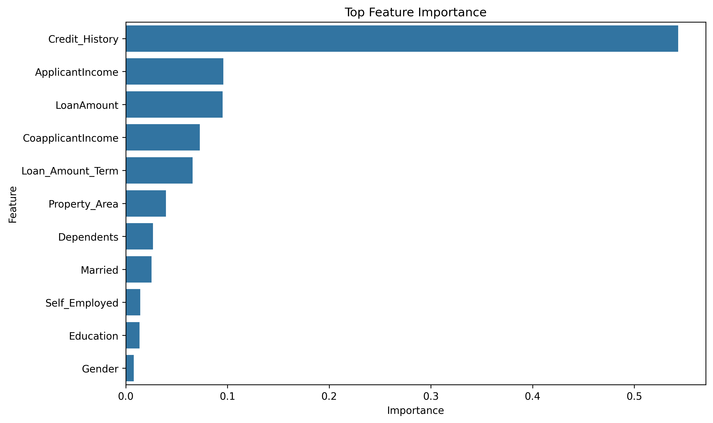

# 🏦 Loan Approval Prediction using Machine Learning

## 📌 Project Overview

This project predicts whether a loan application will be **Approved** or **Not Approved** using Machine Learning. It demonstrates a complete machine learning workflow, including data preprocessing, exploratory data analysis (EDA), model training, hyperparameter tuning, evaluation, model saving, and a Streamlit web application.

---

## 📂 Dataset

**Dataset:** Loan Prediction Dataset

The dataset contains applicant information such as:

- Gender
- Married
- Dependents
- Education
- Self Employed
- Applicant Income
- Coapplicant Income
- Loan Amount
- Loan Amount Term
- Credit History
- Property Area
- Loan Status (Target)

---

## 🚀 Technologies Used

- Python
- Pandas
- NumPy
- Matplotlib
- Seaborn
- Scikit-learn
- Joblib
- Streamlit

---

## 📊 Machine Learning Workflow

- Data Loading
- Data Cleaning
- Missing Value Handling
- Exploratory Data Analysis (EDA)
- Label Encoding
- Feature Engineering
- Train-Test Split
- Model Training
- Hyperparameter Tuning
- Model Evaluation
- Feature Importance Analysis
- Model Saving
- Streamlit Web Application

---

## 🤖 Models Used

- Logistic Regression
- Random Forest Classifier

---

## 📈 Evaluation Metrics

- Accuracy Score
- Confusion Matrix
- Classification Report
- Precision
- Recall
- F1-Score

---

## 🖥️ Streamlit Application

Run the following command:

```bash
streamlit run app.py
```

---

## 📁 Project Structure

```text
Loan-Approval-Prediction/
│
├── app.py
├── LoanApprovalPrediction.ipynb
├── loan_model.pkl
├── train.csv
├── requirements.txt
├── README.md
├── LICENSE
└── images/
    ├── app_home.png
    ├── prediction.png
    ├── heatmap.png
    └── feature_importance.png
```

---

## 📷 Application



---

## 📷 Prediction Example



---

## 📊 Correlation Heatmap



---

## 📈 Feature Importance



---

## ⚙️ Installation

Install the required packages:

```bash
pip install -r requirements.txt
```

---

## ▶️ Run the Project

```bash
python -m streamlit run app.py
```

---

## 🔮 Future Improvements

- Deploy the application using Streamlit Community Cloud
- Compare additional machine learning algorithms
- Improve feature engineering
- Enhance the Streamlit user interface
- Add model explainability using SHAP

---

## 👨‍💻 Author

**Ahmed**

GitHub: https://github.com/ahmedcodes07

---

## ⭐ If you found this project useful, please consider giving it a Star!
